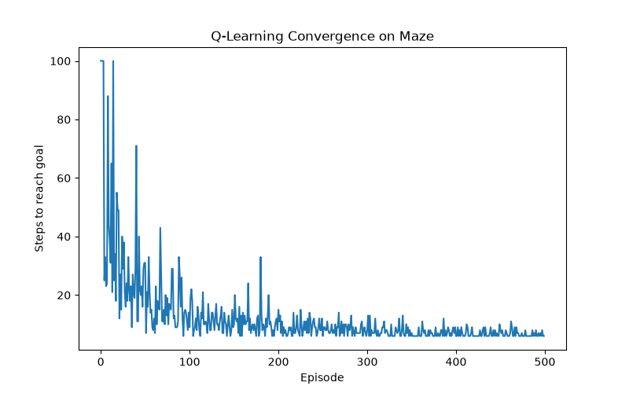
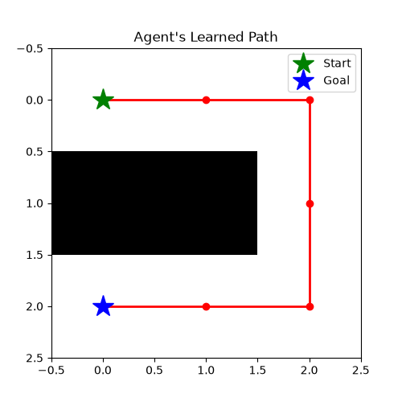

# Q-Learning Maze Solver

An agent that learns to navigate a maze from scratch using Q-learning (reinforcement learning), implemented entirely in NumPy — no ML frameworks (no PyTorch, no TensorFlow, no Gym). Every component — the environment, the Q-table, the Bellman update, epsilon-greedy exploration — is built from first principles.

## How it works

The agent starts with zero knowledge of the maze (a Q-table initialized to all zeros) and learns purely through trial and error across repeated attempts ("episodes"). Each episode:

1. The agent picks an action (up/down/left/right) using an **epsilon-greedy** policy — mostly random at first, gradually shifting toward its learned best guesses as training progresses.
2. It receives a reward: `+100` for reaching the goal, `-1` per step otherwise (encouraging shorter paths).
3. It updates its Q-table using the **Bellman equation**: Q(s,a) ← Q(s,a) + α [ r + γ · max Q(s',·) − Q(s,a) ]


Over hundreds of episodes, reward signal propagates backward through the Q-table, and the agent converges on a near-optimal path — without ever being told the solution.

## Results

- Untrained (episode 1): agent fails to reach the goal within the step cap, moving essentially at random.
- Trained (by ~episode 50): consistently solves the maze in 6–9 steps (near-optimal for the test maze).




## Project structure
qlearning-maze-solver/
├── maze.py # Maze environment: grid, valid moves, goal detection
├── agent.py # QLearningAgent: Q-table, epsilon-greedy policy, Bellman update
├── train.py # Training loop across episodes
├── visualize.py # Learning curve + solved-path visualization
├── test_maze.py # Manual tests for the Maze class
└── requirements.txt


## Setup & usage

```bash
python3 -m venv venv
source venv/bin/activate
pip install -r requirements.txt

python visualize.py   # trains the agent and generates both plots
```

## Key concepts implemented

- Markov Decision Process (MDP) formulation of a grid maze
- Q-learning (model-free, off-policy TD control)
- Epsilon-greedy exploration with decay
- Reward shaping (step penalty + terminal reward)
- Terminal-state handling in the Bellman update

## Possible extensions

- Larger/randomly generated mazes
- Compare against BFS/Dijkstra/A* (classical search) as a baseline
- Swap the Q-table for a small neural network (Deep Q-Learning)